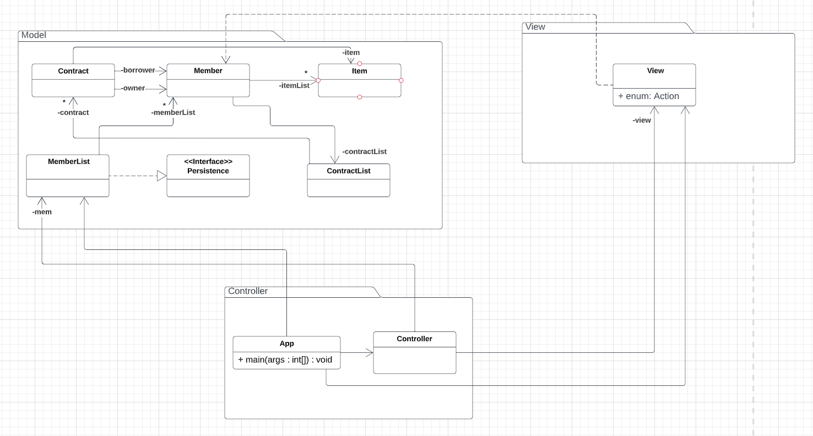
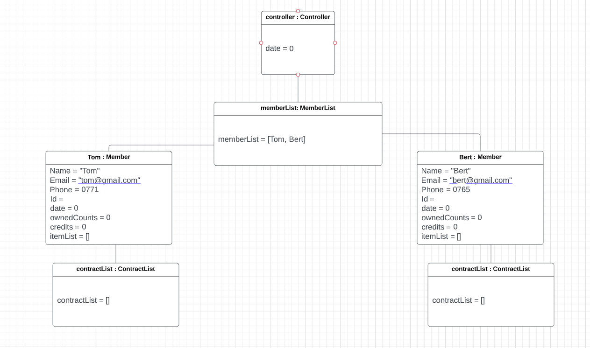
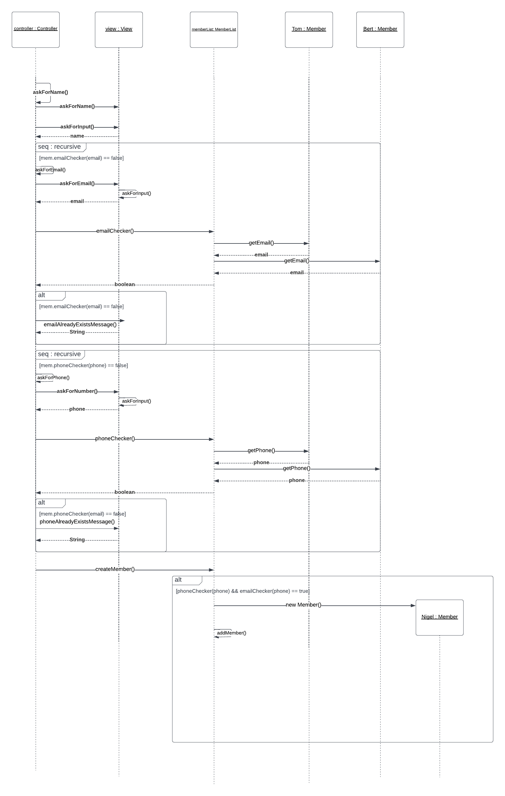

# Lending stuff OO-Design
This document describes the design according to the requirements presented in assignment 2. (Passing grade)

## Architectural Overview
The application uses the model-view-controller (MVC) architectural pattern. The view is passive and gets called from the controller. The view may only read information from the model, not directly change it. This is achieved by returning copies of the object to view.

We feel like everything is described correcly in the diagrams, so we do not have any notes for them.

## Detailed Design
### Class Diagram

This is our class diagram according to a2.

### Object Diagram

This is our object diagram according to a2.

We did not type in id since it is randomly created. 
The third member should but has not yet been added to the system where two members already exists. The reason the itemlists are empty on the two members is because an item is not created by default. A member can exist without item/s. 

### Sequence Diagram

This is our Sequence diagram according to a2.

seq : recursive is run everytime you input an email, even if it's valid (first time). and this is to show that
the function is recursive. One thing to note is that this part is also run when you input an email, because it can't
know if it's valid or invalid if its the first time inputting. We could make a more in depth diagram
to show that it is run again, but this would make the diagram too complicated to read and understand
and we feel like its unnessecary for such a simple thing as recursive functions.

Another thing to note is that MemberList also runs emailchecker itself to "double" check so that it doesn't rely
on that the controller makes the right decision (what if controller doesn't run email checker, we don't want it in a bad state).
phonechecker works exacly as email checker, so it is modelled in the same way.

